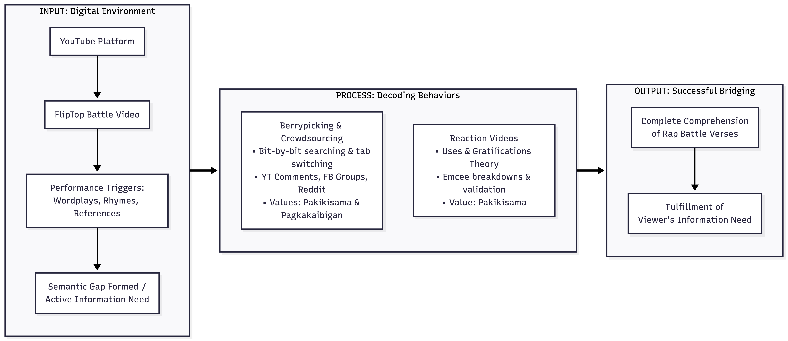

---
format:
  pdf:
    colorlinks: true
    linkcolor: black
    urlcolor: black
    toccolor: black
    documentclass: report
    classoption: [12pt, a4paper]
    geometry:
      - margin=1in
    linestretch: 2.0
    keep-tex: false
bibliography: references.bib
csl: apa.csl
execute:
  echo: false
  warning: false
  message: false
---

\begin{titlepage}
    \begin{center}
        \vspace*{0.5cm}
        
        \textbf{\large University of the Philippines - Diliman}\\
        \textbf{\large School of Library and Information Studies}\\
        
        \vspace{2cm}
        
        {\Large \textbf{DECODING THE BARS: A QUANTITATIVE ANALYSIS OF THE INFORMATION BEHAVIOR OF THE FLIPTOP BATTLE LEAGUE FANBASE}\par}
        
        \vspace{2cm}
        
        Submitted in partial fulfillment of the requirements for\\
        \textbf{LIS 192: Quantitative Research Methods in LIS}
        
        \vspace{2cm}
        
        \textbf{Kristian Mark S. Surat}\\
        201502678\\
        B Library and Information Science
        
        \vfill
        
        Submitted to:\\
        \textbf{Asst. Professor Dan Anthony Dorado}
        
        \vspace{1cm}
        
        \today
        
    \end{center}
\end{titlepage}

# ABSTRACT {.unnumbered}

Since counter-culture media first transitioned to online platforms, there has been a continuous discussion attached to how audiences process dense, culturally specific information. The explosion of Internet-driven video platforms has only accelerated the discussion. This study was undertaken among the fanbase of the FlipTop Battle League, a highly viewed digital rap battle platform. Sixty purposive respondents were identified for the sample. Chi-square analysis was used to answer the first research question: Is there a statistically significant tendency for viewers to exhibit specific information behaviors when encountering complex verses? Results showed a significant reliance on asynchronous decoding behaviors. Chi-square analysis was also used for Research Question 2: Is there a statistically significant reliance on the YouTube comment section as a supplementary tool? A significant reliance was found on community-generated metadata in the comment sections. Last, Research Question 3 was answered utilizing chi-square analysis. Research Question 3 was, Is there a statistically significant prevalence of "berrypicking" techniques during video consumption? The data showed no significant prevalence of active, multi-tab cross-referencing. Implications for further action include recommendations for the integration of in-platform contextual tools supported by the research data. Analysis of existing folksonomies in other online communities is recommended. Recommendations for further research included analyzing different counter-culture variations and continued study of Everyday Life Information Seeking (ELIS). Additional recommendations consisted of further analysis of specific demographic factors affecting audience comprehension, including factors such as age, primary language, and geographic region.

\newpage
\tableofcontents
\newpage

```{r setup, include=FALSE}
# Load required libraries for data analysis
library(ggplot2)
library(psych)
library(dplyr)
library(likert)
```

# INTRODUCTION

## Background of the Study

The Everyday Life Information Seeking (ELIS) framework establishes that the acquisition of information outside formal occupational or academic contexts constitutes a rigorous and necessary domain of Library and Information Science (LIS) research [@savolainen1995]. This validates that individuals systematically seek practical information within nonwork environments, whether it be to construct meaning or resolve cognitive dissonance encountered in complex settings, in this case, rap battles. Rap battles in the Philippines are a recognized form of counterculture that demands active audience participation. FlipTop Battle League is the biggest rap battle league not only in the Philippines but also in the world. It was founded in 2010 by Alaric Yuson, more formally known as Anygma, modeled after Western leagues such as King of the Dot and Grind Time Now [@solitario2019]. It adapted the form to a Philippine setting and gave Filipino hip-hop culture a place to grow online. By using YouTube as its main distribution channel, the league reached people who aren't able to watch the battle live, giving millions of Filipinos free access to high-density lyrical performances. As of 2026, the channel amassed approximately 9 million subscribers and generated 2.8 billion views [@fliptopbattles2026]. This elevates the platform from just an entertainment platform into a massive information hub requiring specific decoding behaviors from its audience.

Moving from spontaneous freestyle to "written" was a critical change in the history of the league [@solitario2019]. In the past, battles depended on a freestyle format, but today, most battles give the emcees about a month to prepare. This change elevated the battle to another level. The battle format has evolved from a basic test of improvised wit, simple rebuttals, and on-the-spot rhyme schemes---sometimes musical---into an advanced show of literary skill. Now, emcees use complex language tricks, such as multisyllabic rhyme schemes or "multis," double entendres, obscure wordplays, and deep references. Due to this higher level of difficulty, a fan's role has evolved from passively listening to actively decoding information. A verse may have meanings that are not clear right away.

With all these variables constantly changing in the battle rap scene and being FlipTop---the leading rap battle league in the Philippines---its audience, boasting millions of subscribers and billions of views, exhibits a strong drive to seek information. Despite their cultural and linguistic differences, the research on how these fans seek, process, and share battle information remains limited. Studying how this audience decodes battle rap content reveals patterns in Filipino digital information behavior and how online communities process and share knowledge.

## Statement of the Problem

While the countercultural significance of the FlipTop Battle League is well-documented [@solitario2019; @soriano2025], the specific Information-Seeking Behaviors (ISB) of its audience remain unmapped within the LIS discipline. It's documented that FlipTop battles became platforms as well for the current news, religious beliefs, personal principles, and even societal and political opinions. The core research gap lies in understanding how the audience decodes information from all these variables. This study argues that viewers decode these complex variables not through passive consumption, but through a highly active, non-linear information-seeking process that relies on digital berrypicking, secondary reaction media, and decentralized community crowdsourcing. Do they have strategies to better understand the bars of the emcees? Do they use any tools to help them follow the deep or obscure references? Does watching the battle pressure the user to remain more informed on current news? These questions solidify the necessity and significance of this study.

## Objectives of the Study

The general objective of the study is to profile the information behaviors of the online audience of FlipTop rap battles. In particular, it aims to:

1. To profile the information behavior of the online audience of the FlipTop rap battles when encountering unfamiliar slang, complex verses, and obscure references.
2. To measure the audience's reliance on YouTube comment sections as a supplementary tool for decoding information.
3. To determine the prevalence of "berrypicking" techniques---opening multiple tabs, shifting search queries---during video consumption.

## Significance of the Study

The study is significant to the following stakeholders:

* **LIS Academe**: This study broadens the scope of ELIS research, especially in the Philippine context. It extends the framework beyond traditional needs; the study extends it more to a digital subculture and leisure-driven information behavior. FlipTop operates as a massive digital counterculture in the Philippines [@solitario2019]. Participation in localized cultural phenomena is a legitimate information practice that is greatly influenced by social norms [@savolainen1995].
* **Digital Archivists**: This study shows how the comment section serves as a hub for uncontrolled metadata. The audience provides their interpretations of the verses, cites timestamps, and elaborates on references, thus acting as a folksonomy for archiving the rap battle.
* **The League (FlipTop)**: This study will help the league in two primary areas. First, actionable data is provided that will help the league's approach to handling the events. They can see where they might adjust the handling of the battles or the video editing itself or see if there's relevance of captioning or chapters on the video, etc. Second, this information will help the emcees themselves know their main stakeholders: the audience. Having this data provides emcees with a competitive advantage in how they structure their rounds, allowing them to tailor their content to resonate with a broader segment of the audience.

# REVIEW OF RELATED LITERATURE

## Literature Review

In the Philippines, FlipTop (which refers to anything related to the actual genre or form "battle rap" or local hip-hop) is one of the growing counterculture phenomena [@solitario2019]. It started with a freestyle battle format. Early formats relied entirely on spontaneous improvisation. The skill to be able to pull that off is a feat in itself, but at some point, this format changes. Now emcees are given weeks of preparation time. This change in format leads to emcees composing pieces with complicated structures and verses with complex underlying meanings. Before, it was a battle of on-the-spot wit and rebuttals; now it's a highly competitive platform for pieces incorporating multies (multisyllabic rhyme schemes), double entendres, dense wordplay, obscure references, and using elements like religion, activism, education, etc. [@soriano2025]. Some emcees even reference former battles, unpopular opinions, and socio-political issues.

The preparation time makes their pieces very complex and gives them time to perfect their delivery and execution---which is crucial for pieces that have a musical component or speed-rap aspect, even pieces with beatboxing incorporated. That is just talking about the lyrical content and delivery aspect of their compositions; now emcees sometimes bring visual aids and props as part of their pieces, others wear costumes as a part of a character they want to portray, and others even bring their crew on stage to better represent their stance on their verses. Visual elements, such as those, act as non-verbal information cues. If a viewer does not recognize the historical or pop-culture figure an emcee is portraying, it immediately creates an information gap. This forces the viewer to pause the video and search for external context before the actual rap verse even begins. By using this written format, the preparation time ultimately changes the stage of battle rap.

Another factor that gives variation in how the audience decodes the battle is the matchup style. Matchup style is the setup and count of participants in the battle. Right now, the current matchup styles recorded in FlipTop are 1v1, 2v2, 3v3, 5v5 (which happened only once within the league and is first in battle rap history), and royal rumble---five emcees are going to battle each other. These different matchup styles add an additional level of complexity to their pieces. The most viewed rap battle in history, based on YouTube viewership, is one of the FlipTop battles---Loonie/Abra vs. Shehyee/Smugglaz, which garnered around 50 million views. 2v2 or Dos Por Dos battles (the term popularized by FlipTop) give an avenue for emcees to create pieces utilizing back-and-forth verses with their teammate, or one beatboxing and the other rapping over it.

The royal rumble is also another setup; this format requires emcees to write verses for their four opponents, and they'll have to fit their style into their rounds and should be able to properly deliver. Additionally, FlipTop has this new matchup setup, an alter-ego battle, where the emcees don't know their opponents and are just assigned aliases specific for that battle. Most of the participants in these battles are veterans; thus, they feel as if they are going into battle again for the first time, not knowing who they are fighting against. This variety of matchup styles just shows the unpredictability of the battles. Multi-participant formats, such as 2v2 or five-man royal rumbles, exponentially increase the viewer's cognitive load. Tracking intersecting lore, complex rebuttals, and rapid back-and-forth exchanges among multiple emcees prevents passive listening. These formats require a highly rigorous, non-linear decoding strategy, often forcing the audience to rely heavily on rewinding and collaborative mapping in the comment section.

The last factor that is worth noting is the languages used in these battles. In FlipTop, battles are mostly in Filipino/Tagalog, but some are also in English. They even have battles between a local emcee and a foreign emcee. This leads to a battle where the local emcee code-switches to cater for the foreign emcee, while the foreign emcee on the other hand, will have to ultimately write a very compelling verse while not fully understanding his opponent. This type of language setup in the battle incites another level of creativity from both the emcees. Over the years, the battle rap culture in the Philippines grew, which in turn produced emcees from all over the Philippines. This scenario leads to having battles in pure Bisaya. Having two official languages, and almost 200 distinct native languages, this plays a role as well in how rap battles turn out. The code-switching between Tagalog, English, and regional dialects like Bisaya introduces a linguistic barrier, prompting digital viewers to seek external translations.

All these variables---the evolution of the battle format, different matchup styles, and language diversity---lead the emcees to consistently elevate the competition and performance of battle rap in the Philippines. This approach produces wealthy, high-density information. Consequently, this method requires its audience to keep up by developing their own decoding strategies, which in turn shapes their information behavior.

Because consuming FlipTop battles generates complex information needs, and the digital space of YouTube serves as its main platform, folksonomies and decentralized archiving emerge as concepts that are hard to ignore [@peters2009; @ellouze2022]. Since its founding in 2010, there have been inherent limitations on YouTube's textual metadata. YouTube does not offer tags for the genre of the emcees, the references used, or even the judgment results. Even now, there's no official transcription of FlipTop provided on YouTube. FlipTop posted some of the battle's verses on their official website, but just as a textual format---not exactly a transcription that can be consumed with the YouTube video. This situation creates a gap for some of the limited moments in battle rap where the captioning is a requirement, for example, speed rap, different accents of the emcee, or the moment the crowd's cheers or shouts cover the emcee's voice. This situation consequently leads to its digital audience generating their own tags or interpretations in the comments. Some comment timestamps are provided for each of the rounds. Some even comment on the timestamps that accompany the verses of the emcee. Others provide explanations for the very obscure wordplay, contextualize some of the unpopular references, and even break down the complex verses of the emcees. This emerging folksonomy within the digital battle rap consumption shows how FlipTop's digital audiences bypass the platform's limitations [@peters2009; @ellouze2022].

Furthermore, there's another way the audience can consume the rap battle online. It also includes reaction videos by some YouTubers and emcees. These creators record themselves watching the rap battle video and reacting to it. This approach creates a new layer of content and value. It is worth noting that this way of watching the battle creates its own strategy for decoding information. Viewing these reaction videos serves as a distinct information-seeking behavior, relying on a surrogate expert to help decode complex lyrics and references [@ghosh2025].

## Theoretical Framework

Consuming rap battles online requires complex, non-linear decoding strategies. Every verse and every bar per round changes a lot of the context of the emcees' pieces. Many factors and variables are involved that will require the audience to have a different strategy for decoding. According to the berrypicking model, information seeking is an evolving bit-by-bit gathering process across multiple sources [@bates1989]. Online viewers do not just really on a single search - their inquiries constantly change as new information comes in. For example, a viewer of a rap battle who pauses the video, searches a term or a references, and extracts and compiles all those context, before resuming the video.

Users must decide whether to resolve their inquiries in the middle of watching the battle or rewatch confusing sections afterward. Another factor is the reaction videos of some YouTubers as a way of consuming the battle. It's another way of decoding the battle with third-party insights that they can conveniently access right away. Furthermore, Reddit threads and Facebook pages play a role in being high-value external hubs for this decoding process. Accessing a plethora of information sources bit-by-bit to have better context and grasp of the existing inquiry strongly aligns with the berrypicking model.

Furthermore, Uses and Gratification Theory (UGT) explains the audience's reliance on reaction and breakdown videos. The nature of digital media forces viewers to actively seek specific content to fulfill their needs [@carrelo2023]. In the context of FlipTop battles' digital consumption, these reaction and breakdown videos provide a new layer of information. Watching them gratifies the viewer's specific needs to decode any inquiry they have on the battle, be it an unfamiliar verse or an obscure reference.

Finally, local digital habits heavily shape this information-seeking process. The Philippines commands some of the highest social media rates globally [@obille2018]. These habits naturally align with decentralized information crowdsourcing. In the context of rap battle consumption online, these habits apply as well, from comment section skimming to being an active collaborator. This behavior is grounded in core Filipino values. Online crowdsourcing is a direct extension of *pakikisama* (getting along) and *pagkakaibigan* (friendship) [@obille2018]. FlipTop viewers might have different insights or opinions on the verses, bars, the battle, or even the results themselves; online crowdsourcing provides an avenue for them to validate their own beliefs. Viewers actively participate in crowdsourcing to reciprocate information sharing within the community [@obille2018]. Facebook is a dense information hub. With the popularity of FlipTop, there are lots of different Facebook groups and pages doing content for the league, whether it be about opinions on the battle results, breakdowns, etc. Now, groups and pages also act as a hub where viewers and fans observe and collectively adopt cultural trends through *gaya-gaya* [@obille2018]. In addition to Facebook, viewers also use Reddit to gather explanations from "real people" and validate their understanding of complex verses.

In conclusion, watching FlipTop is not just passive entertainment. It's an active information-seeking process that requires more than listening. The berrypicking modal and Uses and Gratifications Model strongly explaines that online viewers use multiple platforms to bridge those information gaps, and sometimes they intentionally look for specific information, in this case, reaction videos and emcee breakdown videos. Additionally, these strategies is anchored onto local digital habits and core Filipino values. Watching FlipTop battles is more than just passive consumption, it's a highly collaboration and rich information behaviour where fans and casual viewers simultaneously act as both consumers and contributors.

## Conceptual Framework

{#fig-conceptual-framework}

This study employs a descriptive input-process-output (IPO) model to systematically map the digital viewer's information behavior. The input represents the viewer's digital environment. The process represents the actions the viewer takes to resolve their information gap. Lastly, the output is the successful bridging of the semantic gap.

The primary space for the FlipTop battles is the interactive, asynchronous digital space of YouTube. The FlipTop battle video is the main source of information in this space. And while watching the videos, users are constantly exposed to different performance variables, which act as triggers. These triggers are obscure puns, multi-syllabic rhyme schemes, deep references, multi-participant matchup styles, non-verbal visual cues, etc. These variables often are not merely passive comprehension. Now, the media is bound to its hosting provider and YouTube's metadata cannot provide context for the query. This creates a semantic gap, which disrupts viewing and triggers an information need. The process represents the decoding behaviors that the viewer uses to fill the gap of information. Three different behavioural strategies are used to decode:

* **Berrypicking and Digital Crowdsourcing**: Viewers become involved in a bit-by-bit information-gathering process [@bates1989]. This strategy involves pausing the rap battle video, opening a new tab and searching an inquiry, and just continuously switching and shifting between these external sites to decode unfamiliar slang, obscure wordplay, or deep references. The checking of comment sections acts as well as a bit-by-bit shifting between watching the video and information inquiry. Viewers rely on collaboration to decode. In the context of digital crowdsourcing, other than the convenient YouTube comments, viewers use Facebook groups and Reddit threads as active platforms for validation and straightforward explanations. This might be for the results on the judging, the unexpected reaction of the viewers, or highly ambiguous verses. This strategy is driven by the core Filipino values of *pakikisama* (getting along) and *pagkakaibigan* (friendship) [@obille2018].
* **Reaction Videos**: Applying Uses and Gratifications Theory (UGT), viewers consume another layer of media to decode the rap battles. Emcee breakdowns and reaction videos function as third-party agents for the viewer to easily understand the battle while watching it. Furthermore, these videos provide social validation. These videos will also be a medium of confirmation of their own understanding of the rap battle. This again is driven by *pakikisama* [@obille2018].

The output represents the conclusion of the information behavior. It represents the successful bridging of the information gap. Through the various decoding strategies, finally, the viewer achieves complete understanding and comprehension of the complex rap battle verses. This results in the fulfillment of the viewer's information need.

# METHODOLOGY

## Research Design

The study employs a single-group, quantitative research design, specifically utilizing a descriptive survey approach to investigate the information behavior of the online viewers of FlipTop.

Descriptive survey research design is the most appropriate design for this study because it accurately captures and quantifies the frequency of information behavior patterns within the viewers of FlipTop. Examples of these patterns are searching, browsing, and monitoring. With the number of viewers and fans of FlipTop, it would be easy to accumulate such an amount of data to supply what is needed for the study.

## Population and Sample

The target population comprises the active fans and casual viewers of the FlipTop Battle League. The target sample size for this study is 60 respondents ($N=60$). The study utilizes purposive sampling to select specifically the online viewers of FlipTop that uses YouTube as its main platform for consumption.

In terms of sampling technique, the study uses the snowball sampling technique. Respondents will be asked to share the survey link to their peers to implement this. This is taking advantage of the highly interconnected nature of fandoms, plus, in this case, the big viewership of FlipTop. To recruit respondents, the survey form will be posted on the online pages, groups, and threads dedicated to FlipTop from the different platforms, like Facebook and Reddit. This is done to efficiently reach the target population.

## Research Instruments

The primary research instrument for this study is a researcher-constructed online survey. The instrument will be administered exclusively via Google Forms. The form is divided into sections that are designed to profile and quantify information behavior patterns. The sections are Screening, Demographics, Information Behavior Patterns, Secondary Media and Social Collaboration, and Comprehension and Information Gap Bridging, respectively.

To clearly map the relationship between the survey sections, the constructs measured, and the survey items, a variable-item matrix is provided below.

| Survey Section | Construct Measured | Survey Items |
| :--- | :--- | :--- |
| Information Behavior Patterns | Berrypicking, searching, cross-referencing, and comment skimming | Items 9, 10, 11, 12, 13, 14, 15 |
| Secondary Media and Social Collaboration | Digital crowdsourcing, social validation, and reaction video and emcee breakdown video consumption | Items 16, 17, 18, 19, 20, 21 |
| Comprehension and Information Gap Bridging | Perceived effectiveness of information decoding strategies | Items 22, 23, 24, 25 |

: Variable-Item Matrix {#tbl-variable-item-matrix}

The first section is the screening. This will focus on ensuring that the respondents are fans or casual online viewers of FlipTop. This section strictly enforces purposive sample and exclusion criteria. Additionally, this section also filters the viewers who aren't using YouTube as the main platform to watch rap battles. This section will have 2 items, both of which are multiple-choice.

The second section is the demographic profile of the respondents. This section gathers data on the age and viewing frequency of the respondents. This section will have 5 items, all of which are multiple choice.

The third section is the information behavior profile of the respondents. This section measures how often viewers encounter and deal with unfamiliar slang, complex verses, and obscure references when watching FlipTop rap battles. This section will quantify the different patterns of information behavior; the extent to which viewers engage in berrypicking, searching, and cross-referencing behaviors to resolve information gaps. This section will have 7 items, all of which a 5-point Likert scale.

The fourth section is the viewer's engagement with secondary media and social collaboration to resolve information gaps. This section will quantify the viewer's reliance on digital crowdsourcing platforms like Facebook and Reddit, as well as their consumption of reaction videos and emcee breakdowns. This section will have 6 items, all of which use a 5-point Likert scale.

The fifth and last section evaluates comprehension and information gap bridging. This section will assess the perceived effectiveness of the viewers' decoding strategies, evaluating whether consulting comments, external platforms, and reaction videos successfully resolve their information gaps. This section will have 4 items, all of which use a 5-point Likert scale.

In total, the form is composed of 24 items: 17 Likert-scale items and 7 multiple-choice items.

## Data Collection

Data collection consists of three phases. The first phase involves the completion of the form and deployment, the second phase involves tracking the responses, and the third phase involves closing the form once the number of respondents has been achieved. The survey will be built and sent out via Google Forms. The form provides for the procedures on explicit informed consent pursuant to RA 10173 or the Data Privacy Act. This is to ensure ethical compliance.

The survey form will be circulated in active FlipTop fan communities and pages on Facebook, Reddit, etc. The post will be accompanied by a caption/script to further boost the reach. The scope and purpose of the study are set out in the post. It will clearly state the requirements for qualified respondents, the estimated number of questions, and any personal sensitive information that may be required. The caption also contain information to share with other fans and casual viewers in their networks. That's how to actively implement snowball sampling.

Once the required sample size ($N=60$) is met, data collection is officially closed. It will be cleaned for any invalid and incomplete responses before the data analysis.

## Data Analysis

Data analysis for all hypothesis testing was conducted utilizing R version 4.4.0. The software system provided automated analysis of the statistical measures. The packages `psych`, `ggplot2`, `dyplr`, and `likert` were used to analyze and visualize the data. `dyplr` was used for data manipulation, `psych` was used for descriptive statistics, and `ggplot2` and `likert` were used for data visualization.

# RESULTS

The study had three main purposes. The first purpose was to profile the information behavior of the online audience of the FlipTop rap battles when encountering unfamiliar slang, complex verses, and obscure references. In addition, the study was designed to examine the audience's reliance on YouTube comment sections as a supplementary tool for decoding information. The third part of the study was designed to examine the prevalence of "berrypicking" techniques---opening multiple tabs, shifting search queries---during video consumption.

This chapter begins with the descriptive statistics for the sample: age, primary language background, geographical region, years watching, and viewing frequency. From the three research questions, research hypotheses were developed, and the results of statistical analyses used to test each hypothesis are presented.

```{r survey_data, include=FALSE}
# Load the raw dataset
raw_data <- read.csv("data.csv", check.names = FALSE)

# Rename survey questions for easier reference
names(raw_data)[5:9] <- c("Age", "Language", "Region", "Years_Watching", "Frequency")
names(raw_data)[10:26] <- paste0("Q", sprintf("%02d", 9:25))

# Clean demographic data and enforce data types using dplyr
survey_data <- raw_data %>%
  mutate(
    # Clean demographic text strings
    Age = gsub(" years old", "", Age),
    Age = gsub(" - ", "-", Age),
    Region = ifelse(Region == "National Capital Region (NCR)", "NCR", Region),
    Frequency = gsub(" \\(.*\\)", "", Frequency),
    Frequency = ifelse(Frequency %in% c("A few times a week", "Once a week"), "Weekly", Frequency),
    Frequency = ifelse(Frequency == "Once or twice a month", "Monthly", Frequency),
    
    # Cast demographics to ordered factors for correct plotting
    Age = factor(Age, levels = c("18-24", "25-34", "35-44", "45 or older")),
    Language = factor(Language),
    Region = factor(Region),
    Years_Watching = factor(Years_Watching, levels = c("Less than 1 year", "1-3 years", "4-7 years", "More than 7 years")),
    Frequency = factor(Frequency, levels = c("Daily", "Weekly", "Monthly", "Rarely")),
    
    # Ensure specific Likert items are numeric for hypothesis testing
    Q10 = as.numeric(Q10),
    Q11 = as.numeric(Q11),
    Q13 = as.numeric(Q13),
    Q14 = as.numeric(Q14),
    Q25 = as.numeric(Q25)
  )
```

## Descriptive Statistics

Demographic data for the sample was collected from the online survey platform. The descriptive statistics presented below include age (n = 60), primary language background (n = 60), geographical region (n = 60), years watching (n = 60), and viewing frequency (n = 60). All participants reported complete demographic profiles.

Figure 1 describes the frequencies for the age distribution of the sample selected for the study. The sample was relatively young, with a majority falling within the 18-24 and 25-34 age brackets.

```{r demo_viz, fig.height=4, fig.width=6, fig.cap="Figure 1. Age Distribution of Respondents"}
library(ggplot2)
ggplot(survey_data, aes(x = Age)) +
  geom_bar(fill = "steelblue") +
  geom_text(stat = "count", aes(label = after_stat(count)), vjust = -0.5) +
  scale_y_continuous(expand = expansion(mult = c(0, 0.15))) +
  theme_minimal() +
  labs(title = "Age Distribution of FlipTop Viewers", x = "Age Group", y = "Count")
```

Figure 2 presents the frequency of primary language backgrounds. Tagalog was the most prominent primary language across the continuum, with more Tagalog speakers than Bisaya and other regional language speakers.

```{r demo_viz2, fig.height=4, fig.width=6, fig.cap="Figure 2. Primary Language Background"}
ggplot(survey_data, aes(x = Language)) +
  geom_bar(fill = "seagreen") +
  geom_text(stat = "count", aes(label = after_stat(count)), vjust = -0.5) +
  scale_y_continuous(expand = expansion(mult = c(0, 0.15))) +
  theme_minimal() +
  labs(title = "Primary Language Background", x = "Language", y = "Count")
```

Figure 3 presents the geographical region distribution. Overall, more respondents were located in the National Capital Region (NCR) and Luzon compared to Visayas and Mindanao.

```{r demo_viz3, fig.height=4, fig.width=8, fig.cap="Figure 3. Geographical Region"}
ggplot(survey_data, aes(x = Region)) +
  geom_bar(fill = "mediumpurple") +
  geom_text(stat = "count", aes(label = after_stat(count)), vjust = -0.5) +
  scale_y_continuous(expand = expansion(mult = c(0, 0.15))) +
  theme_minimal() +
  labs(title = "Geographical Region", x = "Region", y = "Count") +
  theme(axis.text.x = element_text(angle = 15, hjust = 1))
```

Figure 4 presents the years watching history of the respondents. Overall, more respondents selected "More than 7 years" than any other category, indicating a highly retained, long-term fanbase.

```{r demo_viz4, fig.height=4, fig.width=6, fig.cap="Figure 4. Years Watching FlipTop"}
ggplot(survey_data, aes(x = Years_Watching)) +
  geom_bar(fill = "darkorange") +
  geom_text(stat = "count", aes(label = after_stat(count)), vjust = -0.5) +
  scale_y_continuous(expand = expansion(mult = c(0, 0.15))) +
  theme_minimal() +
  labs(title = "Years Watching FlipTop", x = "Years", y = "Count") +
  theme(axis.text.x = element_text(angle = 15, hjust = 1))
```

Figure 5 presents the course viewing frequencies. The majority of viewers engaged with the content on a weekly basis, followed closely by daily viewership.

```{r demo_viz5, fig.height=4, fig.width=6, fig.cap="Figure 5. Viewing Frequency"}
ggplot(survey_data, aes(x = Frequency)) +
  geom_bar(fill = "coral") +
  geom_text(stat = "count", aes(label = after_stat(count)), vjust = -0.5) +
  scale_y_continuous(expand = expansion(mult = c(0, 0.15))) +
  theme_minimal() +
  labs(title = "Viewing Frequency", x = "Frequency", y = "Count")
```

## Hypothesis Testing

```{r hypo_tests, include=FALSE}
# H1: Information Profiling Behavior (Q14 - Rewinding)
h1_chi_test <- chisq.test(table(factor(survey_data$Q14, levels=1:5)))
h1_chi      <- round(h1_chi_test$statistic, 3)
h1_df       <- h1_chi_test$parameter
h1_p        <- round(h1_chi_test$p.value, 3)

# H2: Comment Section Reliance (Q13 - Skimming comments)
h2_chi_test <- chisq.test(table(factor(survey_data$Q13, levels=1:5)))
h2_chi      <- round(h2_chi_test$statistic, 3)
h2_df       <- h2_chi_test$parameter
h2_p        <- round(h2_chi_test$p.value, 3)

# H3: Berrypicking Prevalence (Q10 - Multiple tabs)
h3_chi_test <- chisq.test(table(factor(survey_data$Q10, levels=1:5)))
h3_chi      <- round(h3_chi_test$statistic, 3)
h3_df       <- h3_chi_test$parameter
h3_p        <- round(h3_chi_test$p.value, 3)
```

H1: There is a statistically significant tendency for viewers to exhibit specific information behaviors, such as rewinding after reading an explanation, when encountering complex verses at the 0.05 level of significance. The sample consisted of 60 viewers enrolled in the FlipTop Battle League fanbase demographic. The hypothesis testing began with the analysis of the frequency distribution for rewinding behaviors. Chi-square goodness-of-fit analysis was selected to observe whether a specific distribution of frequencies is the same as if it were to occur by chance.

The result of the chi-square testing (X2 = `r h1_chi`, p = `r h1_p`, df = `r h1_df`) indicated there was a statistically significant distribution representing a high frequency of this information behavior compared to chance. The research hypothesis was supported.

H2: There is a statistically significant reliance on the YouTube comment section as a supplementary tool for decoding information at the 0.05 level of significance. The sample consisted of 60 respondents. The data are organized with comment section reliance (skimming for explanations) as the variable of interest. Chi-square analysis was selected to observe whether a specific distribution of frequencies is the same as if it were to occur by chance.

The result of the chi square testing (X2 = `r h2_chi`, p = `r h2_p`, df = `r h2_df`) indicated there was a statistically significant reliance on the comment section for decoding information compared to random chance. The research hypothesis was supported.

H3: There is a statistically significant prevalence of "berrypicking" techniques, specifically opening multiple tabs and shifting search queries, during video consumption at the 0.05 level of significance. The sample consisted of 60 respondents. The data are organized with multiple tab usage as the variable of interest. Chi-square analysis was selected to observe whether a specific distribution of frequencies is the same as if it were to occur by chance.

The result of the chi-square testing (X2 = `r h3_chi`, p = `r h3_p`, df = `r h3_df`) indicated there was a statistically significant distribution of responses. However, additional frequency results indicated a significant skew towards the "Rarely" and "Never" responses rather than high prevalence. The research hypothesis for high prevalence was not supported.

## Summary

In this chapter, an introduction provided a summary of the analysis and statistical testing and in the order in which it was presented. This was followed by descriptive statistics of the sample, including age range of participants, language background, and years watching history.

Results from testing of H1 revealed a significant distribution confirming distinct information behaviors, such as rewinding complex verses. Chi-square testing was utilized for testing of H2. Results indicated there was a significant reliance on YouTube comment sections as a supplementary decoding tool. H3 was also tested utilizing chi-square testing. The results indicated no significant prevalence of berrypicking techniques like opening multiple tabs, with respondents preferring to remain on the video platform.

Chapter Five provides a summary of the study, discussion of the findings in relationship to the literature, implications for practice, recommendations for further research, and conclusions.

# INTERPRETATION AND RECOMMENDATIONS

## Introduction
In the preceding chapter, the results of the analysis were reported. Chapter Five consists of the summary of the study, an overview of the problem, purpose statement and research questions, review of the methodology, major findings, and findings related to the literature. Chapter Five also contains implications for further action and recommendations for further research. The purpose of the latter sections is to expand on the research into information-seeking behaviors, including implications for digital folksonomies and future research. Finally, a summary is offered to capture the scope and substance of what has been offered in the research.

## Study Summary
The online consumption of digital media in the Philippines has increased dramatically in the past decade. With the rise of YouTube, the FlipTop Battle League has amassed over two billion views, establishing itself as the most-viewed rap battle league globally. As the cultural footprint has grown, so has the density and complexity of the emcees' verses, leading to potential semantic gaps for the viewers.

The purpose of this study was three-fold. The first purpose of the study was to profile the information behavior of the online audience of the FlipTop rap battles when encountering unfamiliar slang, complex verses, and obscure references. The second purpose of the study was to examine the audience's reliance on YouTube comment sections as a supplementary tool for decoding information. A third purpose of the study was to examine the prevalence of "berrypicking" techniques---opening multiple tabs, shifting search queries---during video consumption. The study was designed to expand the knowledge base concerning everyday life information-seeking behaviors within counter-culture media environments.

The research design was a quantitative study to compare and analyze the decoding habits of the FlipTop Battle League fanbase and casual viewers. Primary data from an online survey was utilized to understand the respondents' behaviors. In order to answer Research Question 1, a sample of 60 respondents who passed the screening section was analyzed. The sample included viewers ranging from daily viewers to those who rarely watch, representing diverse age groups and primary language backgrounds. A chi-square goodness-of-fit test was used to analyze for a potential statistically significant distribution representing the tendency of viewers to exhibit specific information behaviors, such as rewinding after reading an explanation (Research Question 1).

A chi-square test was also used to analyze the reliance on YouTube comment sections and the prevalence of berrypicking techniques (Research Questions 2 and 3). For Research Question 2, data regarding the skimming of comment sections for explanations was analyzed. For Research Question 3, data regarding the frequency of opening multiple tabs to cross-reference information was tested.

A chi-square test was utilized to test H1: There is a statistically significant tendency for viewers to exhibit specific information behaviors, such as rewinding after reading an explanation, when encountering complex verses at the 0.05 level of significance. Chi-square testing was utilized to observe whether a specific distribution of frequencies is the same as if it were to occur by chance. The results of the test indicated there was a statistically significant distribution representing a high frequency of this information behavior compared to chance. The research hypothesis was supported.

To test the next hypothesis, chi-square testing was utilized. H2: There is a statistically significant reliance on the YouTube comment section as a supplementary tool for decoding information at the 0.05 level of significance. The result of the chi-square testing indicated there was a statistically significant reliance on the comment section for decoding information compared to random chance. The research hypothesis was supported.

To test the final hypothesis, chi-square testing was also used. H3: There is a statistically significant prevalence of "berrypicking" techniques, specifically opening multiple tabs and shifting search queries, during video consumption at the 0.05 level of significance. The result of the chi-square testing indicated there was a statistically significant distribution of responses. However, additional frequency results indicated a significant skew towards the "Rarely" and "Never" responses rather than high prevalence. The research hypothesis for high prevalence was not supported. Testing found that uninterrupted consumption was high across the format, leading to the interpretation that viewers prefer to remain within the video platform rather than actively "berrypicking" across multiple search engines.

The results found a significant reliance on asynchronous decoding behaviors and YouTube comment sections, but no significant prevalence of real-time berrypicking techniques for viewers of FlipTop battles. The implication of these results compared to current literature is discussed in the next section.

## Findings Related to the Literature
Online video consumption has become a strategy for audiences to engage with dense, multi-layered lyrical content at their own pace. Digital platforms have utilized comment sections for over a decade to provide a space for discussion, but it was only within recent years that crowdsourced metadata had essentially replaced formal annotations and official encyclopedias as the method of choice for decoding complex material.

Utilizing the Everyday Life Information Seeking (ELIS) framework as a measure of behavior, studies conducted by Savolainen (1995) found a significant reliance on social networks and community-generated knowledge when individuals seek information outside formal academic settings. These analyses utilized multiple qualitative studies, comparing the search habits of individuals in everyday contexts, primarily utilizing interviews and thematic analysis as the preferred methodology. The results of previous research were supported by the present study. Additionally, this study went further, analyzing quantitative data over a specific counter-culture community, controlling for the effect of specific platform limitations. These results affirm that the FlipTop audience relies heavily on socially constructed "folksonomies."

The third purpose of the study was to determine if a significant prevalence of "berrypicking" techniques existed during the consumption of the battles. Meta-analyses and foundational studies conducted by Bates (1989) concluded a much higher reliance on shifting search queries and fluid information gathering. The previous meta-analyses examined the search patterns of users in academic and professional databases. The chosen method of theoretical modeling was used to describe how users pick up bits of information over time. However, the results of the present study found no significant prevalence of active, multi-tab berrypicking in this specific environment. These results are contrary to the traditional berrypicking expectation. The present study expanded those results, suggesting that in mobile-first video consumption environments, the friction of pausing a video to open new tabs severely diminishes the likelihood of berrypicking, favoring asynchronous consumption instead.

## Conclusions
The use of digital media for counter-culture entertainment, primarily in the form of YouTube rap battles, has both changed and challenged the views of traditional information seeking. Multiple studies have been designed in an effort to examine whether users engage in active search behaviors during everyday leisure activities. The present study agrees with the research indicating there is a statistically significant reliance on community-generated metadata (the comment section) to bridge semantic gaps. In addition, with active searching an issue for all digital media consumers, the data from previous studies indicated a high prevalence of berrypicking and query-shifting for online users. The current study contradicted those arguments in the context of uninterrupted video consumption. In the following sections, implications for action, recommendations for research, and concluding remarks are addressed.

## Implications for Action
As digital platforms move into the 21st century, many have examined issues of user engagement and interface design in an effort to meet the demands of both their creators and their communities. The majority of content creators have initiated formal annotations or closed captions as a strategy to provide context. This study supported existing research utilizing the comment section as a decentralized folksonomy and should alleviate doubt that community crowdsourcing is an ineffective decoding tool. The transition of existing passive viewing into an interactive, community-driven decoding model can be accomplished without sacrificing the audience's engagement.

The study also examined active search behaviors, finding no significant prevalence of multi-tab cross-referencing between the viewers. The findings of this study support the integration of in-platform contextual tools, such as YouTube's video chapters, to alleviate the cognitive load on viewers without forcing them to abandon the primary video interface.

Finally, this study can provide the basis for further action, including analyzing other rap battle leagues and content formats offered in a similar delivery model by YouTube. The analysis of other dense lyrical content would enhance further development of community-driven metadata systems.

## Recommendations for Future Research
Digital media consumption has expanded dramatically with the use of mobile platforms for online video. The present study could be continued in future years to measure the effects of specific interface changes made to online delivery platforms, such as the implementation of integrated annotations. In addition, the study could be expanded to include specific characteristics of viewer demographics named in the literature, such as examining whether the primary language or geographic region of viewers provides any insight into their reliance on secondary media like reaction videos.

The study could also be expanded to include other rap battle leagues with similar subcultural elements (such as URL or KOTD) and other disciplines. Because the body of research is limited concerning the information behaviors of audiences consuming dense, non-traditional media, there is value in continuing to study these decoding rates, both in a localized format and in more internationally based settings.

## Concluding Remarks
The current study examined the FlipTop Battle League fanbase's information behaviors, utilizing data collected from a purposive sample of viewers. The study was developed to allow researchers to understand how audiences decode complex, culturally dense rap verses in an everyday leisure context. Three hypotheses were tested in this study, examining information profiling behaviors, comment section reliance, and the prevalence of berrypicking techniques of viewers. Significant distributions were found for the first two hypotheses, while the third hypothesis regarding high berrypicking prevalence was not supported.

These results form a strong foundation for expanding Everyday Life Information Seeking research at the intersection of hip-hop culture and digital media. By addressing two of the major concerns of information science---social collaboration and search friction---the study results allow expansion of ELIS theories to benefit from data-driven decision-making in counter-culture media. Other institutions can and should utilize data to examine existing online communities and folksonomies.

# REFERENCES

::: {#refs}
:::

\appendix
\chapter{SURVEY QUESTIONNAIRE}
\section*{Informed Consent}
\textit{This study aims to profile the information behavior of the online audience of FlipTop rap battles. In compliance with the Philippine Data Privacy Act of 2012 (RA 10173), please be assured that all personal information gathered will be kept strictly confidential, anonymized, and used solely for academic purposes. Your participation is completely voluntary.}

\vspace{0.3cm}
\begin{itemize}
    \item[$\square$] \textbf{I have read the information above and voluntarily consent to participate in this study.}
\end{itemize}

\vspace{0.5cm}
\section*{Part I: Screening}
\textit{Directions: Please answer the following questions to the best of your ability by checking the appropriate box.}

\begin{enumerate}
    \item \textbf{Do you watch FlipTop rap battles online?}
    \begin{itemize}
        \item[$\square$] Yes
        \item[$\square$] No \textit{(If no, you may stop answering here. Thank you for your time.)}
    \end{itemize}

    \item \textbf{Is YouTube your primary platform for watching these battles?}
    \begin{itemize}
        \item[$\square$] Yes
        \item[$\square$] No \textit{(If no, you may stop answering here. Thank you for your time.)}
    \end{itemize}
\end{enumerate}

\vspace{0.5cm}
\section*{Part II: Demographics}
\textit{Directions: If you passed the screening section above, please provide your demographic information.}

\begin{enumerate}
    \setcounter{enumi}{3}
    \item \textbf{What is your age?}
    \begin{itemize}
        \item[$\square$] 18-24
        \item[$\square$] 25-34
        \item[$\square$] 35-44
        \item[$\square$] 45 or older
    \end{itemize}

    \item \textbf{What is your primary language background?}
    \begin{itemize}
        \item[$\square$] Tagalog
        \item[$\square$] Bisaya
        \item[$\square$] English
        \item[$\square$] Ilokano
        \item[$\square$] Other
    \end{itemize}

    \item \textbf{What is your geographic region?}
    \begin{itemize}
        \item[$\square$] National Capital Region (NCR)
        \item[$\square$] Luzon (outside NCR)
        \item[$\square$] Visayas
        \item[$\square$] Mindanao
        \item[$\square$] Outside the Philippines
    \end{itemize}

    \item \textbf{How many years have you been watching FlipTop battles?}
    \begin{itemize}
        \item[$\square$] Less than 1 year
        \item[$\square$] 1-3 years
        \item[$\square$] 4-7 years
        \item[$\square$] More than 7 years
    \end{itemize}

    \item \textbf{What is your viewing frequency?}
    \begin{itemize}
        \item[$\square$] Daily
        \item[$\square$] Weekly
        \item[$\square$] Monthly
        \item[$\square$] Rarely
    \end{itemize}
\end{enumerate}

\vspace{0.5cm}
\section*{Part III: Information Behavior Patterns}
\textit{Directions: Please rate how often you perform the following actions while watching a FlipTop battle online. \\
(1 = Never, 2 = Rarely, 3 = Sometimes, 4 = Often, 5 = Always)}

\vspace{0.3cm}
\begin{enumerate}
    \setcounter{enumi}{8}
    \item \textbf{How often do you pause a video to research unfamiliar slang or obscure references?} \\
    {\footnotesize \itshape Gaano mo kadalas i-pause ang video para mag-research ng mga hindi pamilyar na slang o malalalim/malabong references?}
    \begin{itemize}
        \item[] $\square$ 1 \hspace{0.5cm} $\square$ 2 \hspace{0.5cm} $\square$ 3 \hspace{0.5cm} $\square$ 4 \hspace{0.5cm} $\square$ 5
    \end{itemize}

    \item \textbf{How often do you open multiple tabs to cross-reference information about a battle?} \\
    {\footnotesize \itshape Gaano mo kadalas magbukas ng maraming tab (multiple tabs) para i-cross-reference o ikumpara ang impormasyon tungkol sa laban?}
    \begin{itemize}
        \item[] $\square$ 1 \hspace{0.5cm} $\square$ 2 \hspace{0.5cm} $\square$ 3 \hspace{0.5cm} $\square$ 4 \hspace{0.5cm} $\square$ 5
    \end{itemize}

    \item \textbf{How often do you search for external translations when an emcee uses a regional dialect (e.g., Bisaya) or heavily code-switches during a battle?} \\
    {\footnotesize \itshape Gaano mo kadalas maghanap ng translation o salin kapag gumamit ang emcee ng ibang diyalekto (hal. Bisaya) o madalas mag-code-switch sa gitna ng laban?}
    \begin{itemize}
        \item[] $\square$ 1 \hspace{0.5cm} $\square$ 2 \hspace{0.5cm} $\square$ 3 \hspace{0.5cm} $\square$ 4 \hspace{0.5cm} $\square$ 5
    \end{itemize}

    \item \textbf{How often do you pause a video to research the context of an emcee's visual prop, costume, or character portrayal?} \\
    {\footnotesize \itshape Gaano mo kadalas i-pause ang video para mag-research tungkol sa konteksto ng ginamit na visual prop, costume, o pag-arte (character portrayal) ng isang emcee?}
    \begin{itemize}
        \item[] $\square$ 1 \hspace{0.5cm} $\square$ 2 \hspace{0.5cm} $\square$ 3 \hspace{0.5cm} $\square$ 4 \hspace{0.5cm} $\square$ 5
    \end{itemize}
    
    \item \textbf{How often do you actively skim the YouTube comment section specifically to find explanations for complex verses?} \\
    {\footnotesize \itshape Gaano mo kadalas basahin nang mabilis (i-skim) ang YouTube comment section para lang maghanap ng paliwanag sa mga kumplikadong linya o berso?}
    \begin{itemize}
        \item[] $\square$ 1 \hspace{0.5cm} $\square$ 2 \hspace{0.5cm} $\square$ 3 \hspace{0.5cm} $\square$ 4 \hspace{0.5cm} $\square$ 5
    \end{itemize}
    
    \item \textbf{How often do you rewind or rewatch specific rounds after reading an explanation from external sources?} \\
    {\footnotesize \itshape Gaano mo kadalas i-rewind o panoorin ulit ang mga partikular na round matapos mong magbasa ng paliwanag mula sa ibang sources?}
    \begin{itemize}
        \item[] $\square$ 1 \hspace{0.5cm} $\square$ 2 \hspace{0.5cm} $\square$ 3 \hspace{0.5cm} $\square$ 4 \hspace{0.5cm} $\square$ 5
    \end{itemize}

    \item \textbf{How often do you find yourself needing to rewind and rewatch multi-participant battles (e.g., 2v2, Royal Rumble) compared to standard 1v1 battles?} \\
    {\footnotesize \itshape Gaano mo kadalas maramdaman na kailangan mong i-rewind at panoorin ulit ang mga multi-participant battle (hal. 2v2, Royal Rumble) kumpara sa karaniwang 1v1 battle?}
    \begin{itemize}
        \item[] $\square$ 1 \hspace{0.5cm} $\square$ 2 \hspace{0.5cm} $\square$ 3 \hspace{0.5cm} $\square$ 4 \hspace{0.5cm} $\square$ 5
    \end{itemize}
\end{enumerate}

\vspace{0.5cm}
\section*{Part IV: Secondary Media \& Social Collaboration}
\textit{Directions: Please rate how often you perform the following actions regarding secondary media. \\
(1 = Never, 2 = Rarely, 3 = Sometimes, 4 = Often, 5 = Always)}

\vspace{0.3cm}
\begin{enumerate}
    \setcounter{enumi}{15}
    \item \textbf{How often do you watch reaction videos or emcee breakdowns to gain a better understanding of the battle?} \\
    {\footnotesize \itshape Gaano mo kadalas panoorin ang mga reaction video o emcee breakdown para mas maintindihan ang battle?}
    \begin{itemize}
        \item[] $\square$ 1 \hspace{0.5cm} $\square$ 2 \hspace{0.5cm} $\square$ 3 \hspace{0.5cm} $\square$ 4 \hspace{0.5cm} $\square$ 5
    \end{itemize}

    \item \textbf{How often do you use Facebook (groups, pages, or comments) to validate your understanding and resolve information gaps?} \\
    {\footnotesize \itshape Gaano mo kadalas gamitin ang Facebook (mga grupo, page, o komento) para kumpirmahin (i-validate) ang iyong pagkakaunawa at punan ang mga kulang na impormasyon?}
    \begin{itemize}
        \item[] $\square$ 1 \hspace{0.5cm} $\square$ 2 \hspace{0.5cm} $\square$ 3 \hspace{0.5cm} $\square$ 4 \hspace{0.5cm} $\square$ 5
    \end{itemize}

    \item \textbf{How often do you use Reddit (e.g., r/FlipTop) to validate your understanding and resolve information gaps?} \\
    {\footnotesize \itshape Gaano mo kadalas gamitin ang Reddit (hal. r/FlipTop) para kumpirmahin ang iyong pagkakaunawa at punan ang mga kulang na impormasyon?}
    \begin{itemize}
        \item[] $\square$ 1 \hspace{0.5cm} $\square$ 2 \hspace{0.5cm} $\square$ 3 \hspace{0.5cm} $\square$ 4 \hspace{0.5cm} $\square$ 5
    \end{itemize}

    \item \textbf{How often do you privately discuss with friends to validate your understanding and resolve information gaps?} \\
    {\footnotesize \itshape Gaano mo kadalas pribadong kausapin o i-chat ang iyong mga kaibigan para kumpirmahin ang iyong pagkakaunawa at punan ang mga kulang na impormasyon?}
    \begin{itemize}
        \item[] $\square$ 1 \hspace{0.5cm} $\square$ 2 \hspace{0.5cm} $\square$ 3 \hspace{0.5cm} $\square$ 4 \hspace{0.5cm} $\square$ 5
    \end{itemize}
    
    \item \textbf{How often do you adopt the general consensus of a group when you initially don't understand a complex verse or the judges' decision?} \\
    {\footnotesize \itshape Gaano mo kadalas sang-ayunan o tanggapin na lang ang pangkalahatang opinyon (consensus) ng grupo kapag sa simula ay hindi mo maintindihan ang isang kumplikadong berso o ang naging desisyon ng mga hurado?}
    \begin{itemize}
        \item[] $\square$ 1 \hspace{0.5cm} $\square$ 2 \hspace{0.5cm} $\square$ 3 \hspace{0.5cm} $\square$ 4 \hspace{0.5cm} $\square$ 5
    \end{itemize}

    \item \textbf{How often do you write comments to provide timestamps, explain a complex verse, or help other viewers understand a reference?} \\
    {\footnotesize \itshape Gaano ka kadalas mag-iwan ng komento para magbigay ng timestamp, magpaliwanag ng kumplikadong berso, o tulungan ang ibang manonood na maintindihan ang isang reference?}
    \begin{itemize}
        \item[] $\square$ 1 \hspace{0.5cm} $\square$ 2 \hspace{0.5cm} $\square$ 3 \hspace{0.5cm} $\square$ 4 \hspace{0.5cm} $\square$ 5
    \end{itemize}
\end{enumerate}

\vspace{0.5cm}
\section*{Part V: Comprehension and Information Gap Bridging}
\textit{Directions: Please rate how strongly you agree with the following statements regarding the outcome of your information-seeking habits. \\
(1 = Strongly Disagree, 2 = Disagree, 3 = Neutral, 4 = Agree, 5 = Strongly Agree)}

\vspace{0.3cm}
\begin{enumerate}
    \setcounter{enumi}{21}
    \item \textbf{Checking the comment section helps me successfully understand complex verses.} \\
    {\footnotesize \itshape Ang pagtingin sa comment section ay nakatutulong sa akin upang matagumpay na maunawaan ang mga kumplikadong berso.}
    \begin{itemize}
        \item[] $\square$ 1 \hspace{0.5cm} $\square$ 2 \hspace{0.5cm} $\square$ 3 \hspace{0.5cm} $\square$ 4 \hspace{0.5cm} $\square$ 5
    \end{itemize}

    \item \textbf{After using external sources (e.g., Google, Reddit), I successfully bridge my information gaps regarding obscure references.} \\
    {\footnotesize \itshape Matapos gumamit ng mga external source (hal. Google, Reddit), matagumpay kong napupunan ang mga kulang na impormasyon tungkol sa mga malalalim o malalabong references.}
    \begin{itemize}
        \item[] $\square$ 1 \hspace{0.5cm} $\square$ 2 \hspace{0.5cm} $\square$ 3 \hspace{0.5cm} $\square$ 4 \hspace{0.5cm} $\square$ 5
    \end{itemize}

    \item \textbf{Watching reaction videos or emcee breakdowns improves my overall comprehension of the battle.} \\
    {\footnotesize \itshape Ang panonood ng mga reaction video o emcee breakdown ay nagpapabuti sa aking pangkalahatang pag-unawa sa battle.}
    \begin{itemize}
        \item[] $\square$ 1 \hspace{0.5cm} $\square$ 2 \hspace{0.5cm} $\square$ 3 \hspace{0.5cm} $\square$ 4 \hspace{0.5cm} $\square$ 5
    \end{itemize}

    \item \textbf{My overall understanding of FlipTop battles has improved because of my active information-seeking habits.} \\
    {\footnotesize \itshape Napabuti ang pangkalahatan kong pag-unawa sa mga FlipTop battle dahil sa aking mga aktibong gawi sa paghahanap ng impormasyon.}
    \begin{itemize}
        \item[] $\square$ 1 \hspace{0.5cm} $\square$ 2 \hspace{0.5cm} $\square$ 3 \hspace{0.5cm} $\square$ 4 \hspace{0.5cm} $\square$ 5
    \end{itemize}
\end{enumerate}
